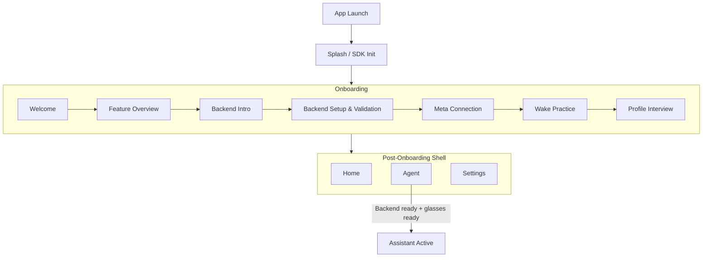

# PortWorld iOS App

SwiftUI iOS client that connects Meta Ray-Ban smart glasses to a self-hosted PortWorld AI backend. Streams audio, captures vision frames, and manages the full assistant lifecycle — from onboarding through realtime conversation.

## Prerequisites

| Requirement | Details |
|-------------|---------|
| **Xcode** | With iOS 17 SDK support |
| **Deployment target** | iOS 17.0+ |
| **PortWorld backend** | A reachable instance (local Docker or remote) |
| **Meta glasses** *(optional)* | Ray-Ban Meta glasses with the Meta AI app installed |

You can build the app and explore most flows without glasses hardware. Meta integration is required only for the full glasses runtime path.

## Quickstart

### 1. Start the backend

From the repository root:

```bash
cp backend/.env.example backend/.env
# Edit backend/.env — set OPENAI_API_KEY or GEMINI_LIVE_API_KEY
docker compose up --build
```

Verify the backend is running:

```bash
curl http://127.0.0.1:8080/livez
```

### 2. Open the project

```bash
open IOS/PortWorld.xcodeproj
```

1. Let Xcode resolve Swift Package dependencies.
2. Select the **PortWorld** scheme.
3. Build and run on a device or simulator.

### 3. Configure the backend

In the app's onboarding flow:

1. Enter your backend base URL (e.g. `http://<your-ip>:8080`).
2. The app validates the connection by calling `/livez` and `/readyz`.
3. If using bearer auth, enter the token — it is stored securely in Keychain.

## Siri Shortcuts

The app includes a Siri shortcut that opens PortWorld and tries to start the assistant session immediately.

Available phrases:

- `Start PortWorld session`
- `Start assistant in PortWorld`
- `Launch PortWorld assistant session`

If onboarding is not complete, backend setup is not ready, or glasses readiness is blocked, Siri still opens the app and PortWorld shows a blocked-state message instead of starting the session.

## App Flow



When the assistant is active, it listens for the configured wake phrase, opens a backend session for the conversation, and returns to idle when the sleep phrase is detected.

## Project Layout

```text
IOS/PortWorld/
├── App/                  # onboarding flow, home/settings screens, readiness models
├── Views/                # root app views and shared presentation surfaces
├── ViewModels/           # thin view-model bridge into runtime state
├── Runtime/
│   ├── Assistant/        # assistant state machine and conversation lifecycle
│   ├── Transport/        # backend WebSocket client and wire types
│   ├── Playback/         # assistant playback engine
│   ├── Wake/             # wake and sleep phrase detection
│   ├── AudioIO/          # audio route control for phone and glasses paths
│   └── Glasses/          # Meta DAT lifecycle, registration, discovery, vision capture
├── Audio/                # shared audio helpers and session coordination
├── Utilities/            # clocks, keychain storage, small support types
├── Assets.xcassets/
└── StartupLaunchScreen.storyboard
```

## Meta DAT Configuration

The project supports two DAT setup modes:

- **Developer mode** — the default template path, least demanding for local development
- **Registered-project mode** — requires `MetaAppID`, `ClientToken`, and `TeamID`

Additional requirements:

- The `portworld` callback URL scheme must stay aligned with DAT callback configuration.
- The Meta AI app must be installed on the device for registration and permission handoff.

Review `IOS/Config/Config.xcconfig.template` for expected local config values.

## Runtime Configuration

The app derives runtime behavior from `Info.plist`, local xcconfig values, and persisted in-app settings.

### Key Inputs

| Setting | Description |
|---------|-------------|
| `SON_BACKEND_BASE_URL` | Backend base URL |
| Bearer token | Optional; stored in Keychain |
| WebSocket URL | Optional override; defaults to `<base>/ws/session` |
| Vision upload URL | Optional override; defaults to `<base>/vision/frame` |
| Wake phrase / sleep phrase | Configurable in-app |
| Wake detection mode, locale, cooldown | Advanced wake settings |

### Backend Endpoints

| Endpoint | Purpose |
|----------|---------|
| `GET /livez` | Liveness check during setup validation |
| `GET /readyz` | Readiness check during setup validation |
| `WS /ws/session` | Realtime voice session (derived from base URL) |
| `POST /vision/frame` | Vision frame upload (derived from base URL) |

### Required Permissions

| Permission | Usage |
|------------|-------|
| Microphone | Voice capture |
| Speech recognition | Wake phrase detection |
| Camera | Vision frame capture |
| Bluetooth | Meta glasses communication |
| Local network | Backend discovery and access |
| Photo library (add) | Photo capture from glasses |

The app also enables background audio, external accessory support, and Meta app interoperability capabilities.

## Build and Validate

For non-trivial changes:

1. Open `IOS/PortWorld.xcodeproj`.
2. Select the **PortWorld** scheme.
3. Build the app and confirm it compiles cleanly.

If you changed backend-facing behavior, validate the backend setup flow in-app against a reachable deployment. If you changed Meta or glasses flows, validate only the paths your setup supports.

> **Note:** The shared Xcode schemes do not currently provide a maintained test action. The `PortWorldDev` scheme is also shared but builds the same app target.

## Contributor Guidelines

- Treat `IOS/PortWorld/` as the source of truth for the active app.
- Preserve the ownership boundaries between views, view models, assistant runtime, and wearables runtime.
- Keep docs grounded in shipped behavior, not roadmap promises.
- Never commit secrets, private tokens, or environment-specific artifacts.

## More Documentation

- [Root README](../README.md) — project overview, quickstart, provider tables
- [Backend README](../backend/README.md) — backend runtime, API reference, configuration
- [CLI README](../portworld_cli/README.md) — CLI commands, deploy, update
- [Getting Started](../GETTING_STARTED.md) — extended onboarding for all setup paths
- [IOS/AGENTS.md](AGENTS.md) — iOS-specific implementation and verification guidance
