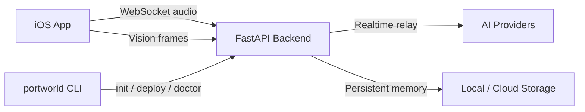

<p align="center">
  
</p>

<p align="center">
  <strong>Open-source runtime for voice-and-vision AI assistants connected to the real world.</strong>
</p>

<p align="center">
  <a href="LICENSE"></a>
  <a href="https://pypi.org/project/portworld/"></a>
  
  
  
</p>

---

PortWorld is a self-hostable backend and iOS client for building AI assistants that can hear, see, and remember. It bridges realtime voice sessions through selectable AI providers, processes vision frames from Meta Ray-Ban smart glasses, and maintains persistent memory across conversations. Deploy locally with Docker, or push to GCP, AWS, or Azure with a single CLI command.

## Architecture



| Surface | Description |
|---------|-------------|
| **[backend/](backend/)** | FastAPI server — realtime voice relay, memory, vision processing, tooling |
| **[portworld_cli/](portworld_cli/)** | CLI — bootstrap, validate, deploy, and operate PortWorld |
| **[portworld_shared/](portworld_shared/)** | Shared Python contracts between CLI and backend |
| **[IOS/](IOS/)** | SwiftUI iOS app — connects Meta smart glasses to your backend |

## Features

- **Realtime voice relay** — bridges WebSocket audio sessions to OpenAI Realtime or Gemini Live
- **Persistent memory** — per-session and cross-session markdown memory with configurable retention
- **Visual memory** — ingests camera frames from Meta glasses, runs adaptive scene-change gating, and builds semantic memory via pluggable vision providers
- **Durable-memory consolidation** — rewrites long-term user memory at session close
- **Realtime tooling** — memory recall and web search tools injected into the active AI session
- **Multi-provider support** — 8 vision providers, 2 realtime providers, web search via Tavily
- **Cloud deployment** — one-command deploy to GCP Cloud Run, AWS ECS/Fargate, or Azure Container Apps
- **Meta smart glasses** — full DAT integration for audio I/O and vision capture through Ray-Ban Meta glasses
- **Bearer token auth and rate limiting** — production-ready security defaults

## Quickstart

### Run PortWorld (without cloning)

Install the CLI and bootstrap a local workspace:

```bash
curl -fsSL --proto '=https' --tlsv1.2 https://raw.githubusercontent.com/portworld/PortWorld/main/install.sh | bash
portworld init
```

Verify:

```bash
portworld doctor --target local
portworld status
```

### Backend contributor

Clone the repo and start the backend with Docker:

```bash
git clone https://github.com/portworld/PortWorld.git
cd PortWorld
cp backend/.env.example backend/.env
# Edit backend/.env — set OPENAI_API_KEY or GEMINI_LIVE_API_KEY
docker compose up --build
```

Verify:

```bash
curl http://127.0.0.1:8080/livez
# → {"status":"ok","service":"portworld-backend"}
```

### iOS contributor

Start the backend (see above), then open the iOS project:

```bash
open IOS/PortWorld.xcodeproj
```

1. Let Xcode resolve Swift Package dependencies.
2. Build the **PortWorld** scheme.
3. Configure the backend URL in the app and validate the connection.

## Minimum Viable Environment

You only need **one API key** to get started. Pick a realtime provider:

| Provider | Set in `backend/.env` |
|----------|----------------------|
| OpenAI Realtime | `REALTIME_PROVIDER=openai` and `OPENAI_API_KEY=sk-...` |
| Gemini Live | `REALTIME_PROVIDER=gemini_live` and `GEMINI_LIVE_API_KEY=...` |

Everything else (vision, tooling, consolidation) is off by default and can be enabled incrementally. See [backend/README.md](backend/README.md) for the full configuration reference.

## Supported Providers

### Realtime

| Provider | ID | Required Key |
|----------|----|-------------|
| OpenAI Realtime | `openai` | `OPENAI_API_KEY` |
| Gemini Live | `gemini_live` | `GEMINI_LIVE_API_KEY` |

### Vision (opt-in)

| Provider | ID | Required Key(s) |
|----------|----|-----------------|
| Mistral | `mistral` | `VISION_MISTRAL_API_KEY` |
| NVIDIA Integrate | `nvidia_integrate` | `VISION_NVIDIA_API_KEY` |
| OpenAI | `openai` | `VISION_OPENAI_API_KEY` |
| Azure OpenAI | `azure_openai` | `VISION_AZURE_OPENAI_API_KEY` + `VISION_AZURE_OPENAI_ENDPOINT` |
| Gemini | `gemini` | `VISION_GEMINI_API_KEY` |
| Claude | `claude` | `VISION_CLAUDE_API_KEY` |
| AWS Bedrock | `bedrock` | `VISION_BEDROCK_REGION` (+ optional IAM credentials) |
| Groq | `groq` | `VISION_GROQ_API_KEY` |

### Search (opt-in)

| Provider | ID | Required Key |
|----------|----|-------------|
| Tavily | `tavily` | `TAVILY_API_KEY` |

Use `portworld providers list` and `portworld providers show <id>` to inspect providers from the CLI.

## Cloud Deployment

Deploy to managed cloud targets with the CLI:

```bash
portworld deploy gcp-cloud-run   --project <project> --region <region>
portworld deploy aws-ecs-fargate --region <region>
portworld deploy azure-container-apps --subscription <sub> --resource-group <rg> --region <region>
```

See the [CLI README](portworld_cli/README.md) for readiness checks, log streaming, and redeployment.

## Documentation

| Document | Description |
|----------|-------------|
| [backend/README.md](backend/README.md) | Backend runtime, API reference, configuration, storage |
| [portworld_cli/README.md](portworld_cli/README.md) | CLI installation, commands, deploy workflows |
| [IOS/README.md](IOS/README.md) | iOS app setup, Meta DAT, permissions, architecture |
| [GETTING_STARTED.md](GETTING_STARTED.md) | Extended onboarding guide with all setup paths |
| [CHANGELOG.md](CHANGELOG.md) | Release history |
| [docs/operations/CLI_RELEASE_PROCESS.md](docs/operations/CLI_RELEASE_PROCESS.md) | CLI release and versioning process |

## Status

PortWorld ships as a public `v0.x` beta. The supported surfaces are usable today, but the project is under active development.

**Stable:** backend self-hosting, CLI bootstrap and deploy workflows, iOS app with Meta glasses integration, published CLI on PyPI.

**Hardening:** managed cloud deploy defaults, public-facing operator documentation, production security posture for one-click deploys.

### Known Limitations

- Provider API keys are required for runtime use — there is no keyless demo mode.
- AWS and Azure one-click deploys provision databases with public access by default. Review and tighten before production use.
- Full iOS runtime validation requires a reachable backend and, for glasses features, supported Meta hardware with the Meta AI app.
- The shared Xcode schemes do not currently include a maintained test action.

## Contributing

Contributions are welcome. Please read [CONTRIBUTING.md](CONTRIBUTING.md) before opening a pull request.

- Bug reports and feature requests: [open an issue](https://github.com/portworld/PortWorld/issues)
- Security vulnerabilities: see [SECURITY.md](SECURITY.md)
- Community expectations: [CODE_OF_CONDUCT.md](CODE_OF_CONDUCT.md)

Do not post secrets, tokens, private URLs, or unredacted production logs in public issues.

## License

MIT — see [LICENSE](LICENSE).
